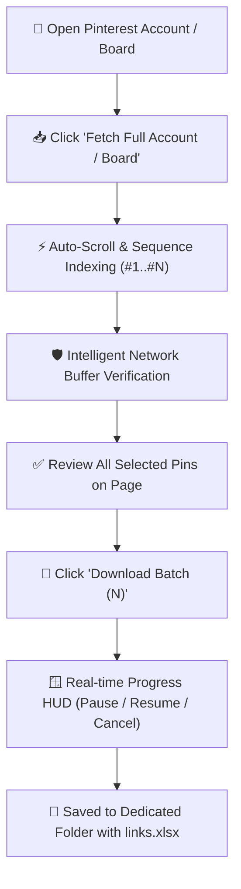

<div align="center">

# 📌 Zumpey.com — Advanced Pinterest Batch Extractor & Downloader

[](https://developer.chrome.com/docs/extensions/mv3/intro/)
[](https://github.com/shaharyarpk2/zumpey-pinterest-downloader/releases)
[](LICENSE)
[](https://zumpey.com)

**Extract Original Ultra-HD Images, 1080p MP4 Videos & Reels, Resolve True Destination Outbound Links, and Export Full Pinterest Accounts & Boards with 1-Click.**

[🚀 Installation Guide](#-instant-installation-guide) • [🌟 Feature Highlights](#-feature-matrix) • [⚡ 2-Step Fetch Engine](#-2-step-smart-fetch--download-engine) • [🔄 Update Center](#-in-app-cloud-update-center) • [🛠️ Configuration](#%EF%B8%8F-customization--naming-tokens)

</div>

---

## 🌟 Feature Matrix

| Feature | Description |
| :--- | :--- |
| **🎬 1080p MP4 Video & Reel Downloader** | Automatically detects video pins and extracts progressive **1080p / 720p MP4 streams** directly with audio. |
| **⚡ 2-Step Smart Fetch & Harvest** | Auto-scrolls full accounts & boards, indexes pins with numbered badges (`#1..#N`), and awaits your command to download. |
| **🎮 Interactive Download Controls** | Real-time **⏸ Pause**, **▶ Resume**, and **⏹ Cancel** buttons to control your active download queue at any second. |
| **🪟 Live Glassmorphic Download Modal** | Centered on-screen HUD with animated neon progress bar, real-time download counter, and celebration badge. |
| **🖼️ True Original Resolution (`/originals/`)** | Bypasses compressed Pinterest thumbnails and retrieves raw original source images with automatic `/736x/` fallback. |
| **🔗 Deep Outbound Website Link Extractor** | Decodes and extracts the actual external website/store link (e.g. `shopify.com`, `amazon.com`, `etsy.com`, blogs) into Excel. |
| **📊 Customizable Excel (`links.xlsx`) & CSV** | Saves spreadsheets as **`links.xlsx`** by default, with customizable file naming, column filters, and header row toggles. |
| **📁 Isolated Batch Folder Structuring** | Automatically organizes downloads into dedicated timestamped subfolders (`Zumpey_Exports/{datetime}_{query}`). |
| **🔄 Zero-Latency In-App Update Center** | Live version monitor that checks GitHub Cloud, displays changelogs, and enables 1-click update installations. |

---

## ⚡ 2-Step Smart Fetch & Download Engine

Unlike traditional extractors that blindly start downloading on scroll, **Zumpey.com** uses an intelligent **2-Step Workflow**:



---

## 🚀 Instant Installation Guide

### Option 1: 🌟 1-Click `.crx` Installation (Enables 100% Silent Auto-Updates)
> **Recommended:** Install once and receive all future updates automatically in the background without re-downloading!

1. Download **[`zumpey.crx`](https://raw.githubusercontent.com/shaharyarpk2/zumpey-pinterest-downloader/main/dist/zumpey.crx)** from GitHub.
2. Open Google Chrome and go to `chrome://extensions/`.
3. Enable **"Developer mode"** in the top-right corner.
4. Drag and drop the downloaded **`zumpey.crx`** file directly onto the extensions page.
5. Click **"Add extension"** to confirm.
6. ✨ **Done!** From now on, Chrome will automatically update Zumpey.com in the background whenever a new version is released!

---

### Option 2: Folder Unpacked Mode (For Developers)
1. Download **[`zumpey.zip`](https://raw.githubusercontent.com/shaharyarpk2/zumpey-pinterest-downloader/main/dist/zumpey.zip)** archive.
2. Extract the folder on your computer.
3. Open `chrome://extensions/` with Developer mode ON.
4. Click **"Load unpacked"** and select the extracted folder.

---

## 🔄 In-App Cloud Update Center

Zumpey.com includes a built-in **Live Cloud Update Checker**:

1. Click the **Zumpey icon** in your browser toolbar -> Click **⚙ Settings** (or right-click extension -> Options).
2. In the left sidebar, click **⚡ Check for Updates**.
3. Click **"Check for Updates Now"**:
   * It connects directly to GitHub Cloud without latency.
   * Displays the latest version number, release date, and detailed changelog notes.
   * Click **[ 📥 Download Update ZIP ]** or **[ 🔄 Reload Extension ]** to update instantly!

---

## 🛠️ Customization & Naming Tokens

Configure your download filename and folder patterns inside the Options page:

### Supported Dynamic Tokens

| Token | Description | Example Output |
| :--- | :--- | :--- |
| `{index}` | Sequential zero-padded index number | `001`, `002`, `045` |
| `{title}` | Sanitized Pin title | `Modern_Living_Room_Aesthetic` |
| `{id}` | Official Pinterest Pin ID | `1085790097654321` |
| `{query}` | Active search query or board context | `fashion_trends` |
| `{board}` | Current Pinterest Board name | `Interior_Design` |
| `{datetime}` | Formatted date and time stamp | `2026-08-21_14-30-00` |
| `{date}` | Current extraction date | `2026-08-21` |
| `{time}` | Current extraction time | `14-30-00` |

---

## 💻 Developer & Contribution Workflow

To build and package releases locally:

```bash
# 1. Clone repository
git clone https://github.com/shaharyarpk2/zumpey-pinterest-downloader.git

# 2. Package release zip & sync updates.xml
python scripts/build_release.py

# 3. Commit and tag release
git add .
git commit -m "Release v1.0.2: Feature update"
git tag v1.0.2
git push origin main --tags
```

---

## 📄 License & Attribution

Distributed under the **MIT License**. See `LICENSE` for more information.  
Crafted with ❤️ by **[Zumpey.com](https://zumpey.com)**.
